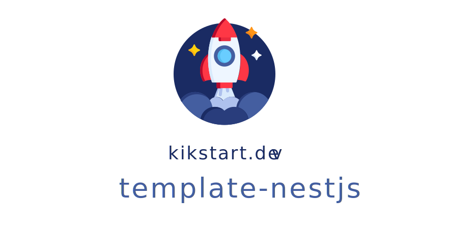

## Description

Opinionated starter template for [Nest.js](https://github.com/nestjs/nest) with GraphQL.

## Installation

```bash
$ yarn install
$ cp .env.example .env
$ yarn build
```

## Running the app

```bash
# development
$ yarn start

# watch mode
$ yarn start:dev

# production mode
$ yarn start:prod
```

## Test

```bash
# unit tests
$ yarn test

# e2e tests
$ yarn test:e2e

# test coverage
$ yarn test:cov
```

## Credits

Based on the [Nest.js TypeScript Starter](https://github.com/nestjs/typescript-starter)

## MIT License
